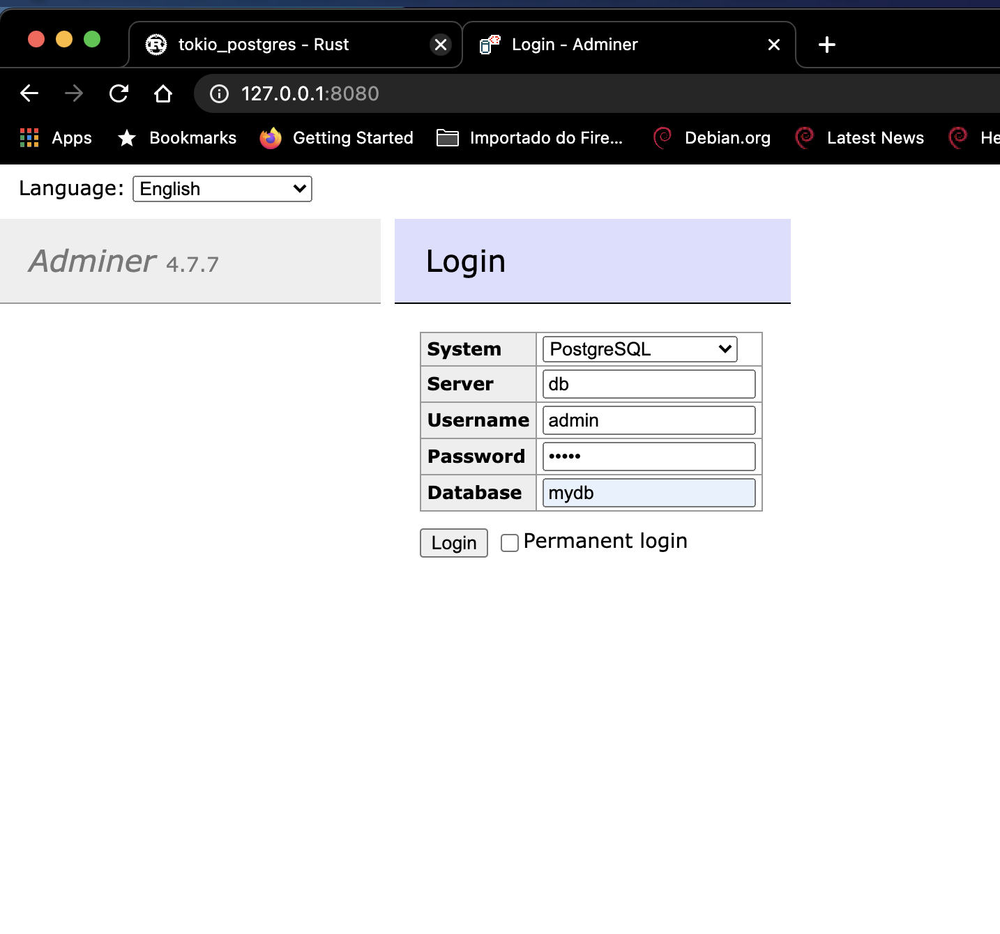
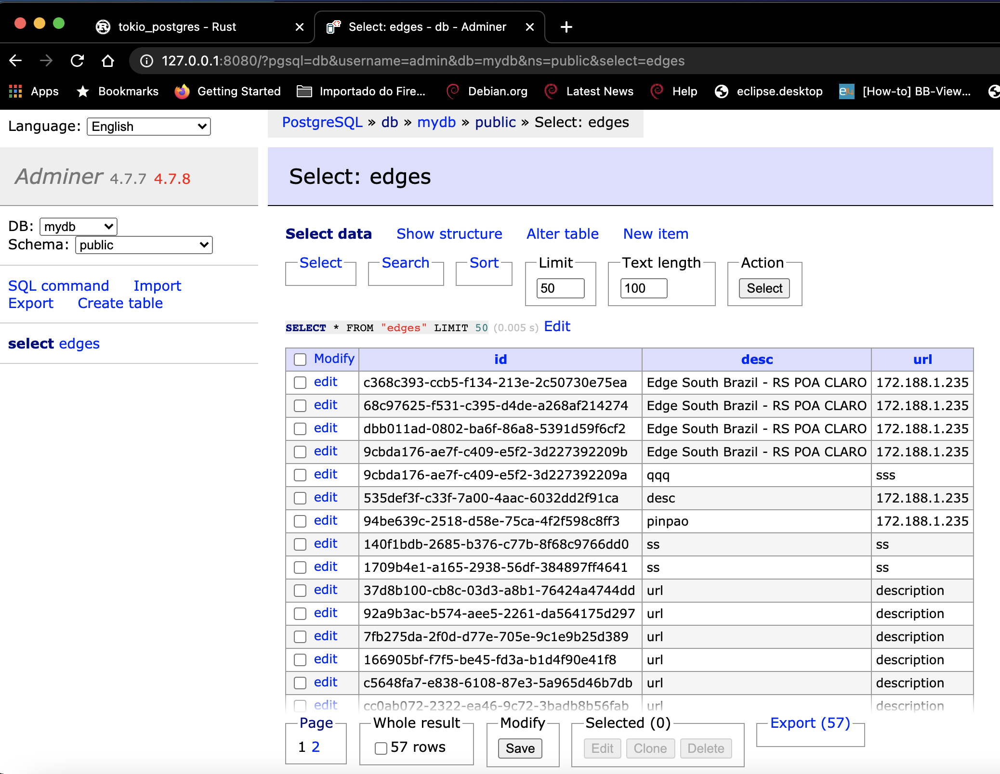
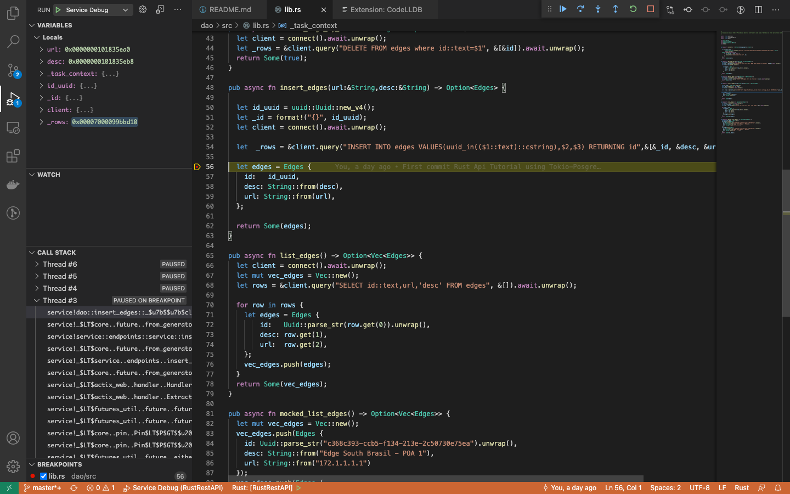

<h1> RustRestAPI </h1>

RUST REST API with database with sql-client asyncrono and pipeline (tokio-postgres).

***
<h2> Create Database using Docker Container </h2>

<h3> Setting up database: </h3>

> docker-compose up

Check running mic0roservice:

>% docker ps
```           
CONTAINER ID   IMAGE               COMMAND                  CREATED          STATUS          PORTS                    NAMES
3a8a15122abd   postgres            "docker-entrypoint.s…"   29 minutes ago   Up 8 minutes    0.0.0.0:5432->5432/tcp   rustrestapi_db_1
9e82a492cee9   adminer             "entrypoint.sh docke…"   35 minutes ago   Up 8 minutes    0.0.0.0:8080->8080/tcp   rustrestapi_adminer_1
```
***
<h3> Migrations (create db): </h3>
    Create database tables, index etc

> cargo run --bin migrations


Use adminer for database administer using web brownser:

Select database postgres, database mydb

> http://127.0.0.1:8080/

* The database, password and user have been set from the docker compose file.

Login adminer for administrator:



Database created after running Migrations:



***
<h3>  Running webservice </h3>

Start server for development:
> cargo run --bin service

```
Finished dev [unoptimized + debuginfo] target(s) in 0.67s Running `target/debug/service`
[2021-10-05T12:35:05Z INFO  actix_server::builder] Starting 4 workers
[2021-10-05T12:35:05Z INFO  actix_server::builder] Starting "actix-web-service-127.0.0.1:8181" service on 127.0.0.1:8000

```

Tests webservice:
> curl -s http://localhost:8181/edges

> curl -s -X PUT "http://localhost:8181/edge/172.188.1.235/desc"

> curl -s http://localhost:8181/edge/e03d0c3c-70b0-9ad3-37e9-50815fbc7ddf | jq .

> curl -s -X DELETE "http://localhost:8181/edge/e03d0c3c-70b0-9ad3-37e9-50815fbc7ddf"

***
<h3> Debuging using Visual Studio Code: </h3>


Install the following plugins:

* CodeLLDB  (https://marketplace.visualstudio.com/items?itemName=vadimcn.vscode-lldb)
* C/C++ for Visual Studio Code  (https://marketplace.visualstudio.com/items?itemName=ms-vscode.cpptools)


<h4> Configure VS Code: </h4>
Now that your tools are installed you need to configure your VS Code launch properties.

Click Debug -> Add Configuration

If you're on Mac or Linux then select LLDB: Custom Launch

If you're on Windows then select C++ (Windows)


<h4> Edit launch.json: </h4>


    In this example there are two debug configurations for both projects. To debug "Migrations" and "Service".


```json

{
    // Use IntelliSense to learn about possible attributes.
    // Hover to view descriptions of existing attributes.
    // For more information, visit: https://go.microsoft.com/fwlink/?linkid=830387
    "version": "0.2.0",
    "configurations": [
    {
        "name": "Migrations",
        "type": "cppdbg",
        "request": "launch",
        "program": "${workspaceFolder}/target/debug/migrations",
        "args": [],
        "stopAtEntry": false,
        "cwd": "${workspaceFolder}",
        "environment": [],
        "externalConsole": false,
        "MIMode": "lldb"
    },
    {
        "name": "Service Debug",
        "type": "cppdbg",
        "request": "launch",
        "program": "${workspaceFolder}/target/debug/service",
        "args": [],
        "stopAtEntry": false,
        "cwd": "${workspaceFolder}",
        "environment": [],
        "externalConsole": false,
        "MIMode": "lldb"
    }
    ]
}

```



For more informations:

Video: 

https://youtu.be/rarFePIdNoc

Site:

https://www.forrestthewoods.com/blog/how-to-debug-rust-with-visual-studio-code/


***
<h3> Project references: </h3>

Tutorial inspiration:

https://medium.com/gdg-vit/creating-performant-rest-apis-with-rust-using-rocket-diesel-and-serde-part-1-7d842eccdee5

Performace compare:

https://medium.com/sean3z/building-a-restful-crud-api-with-rust-1867308352d8


